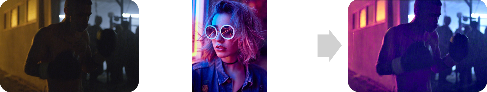

# Video Style Transfer

This repository contains the code for the paper [Photorealistic Style Transfer for Video](https://www.sciencedirect.com/science/article/pii/S0923596521000953).

## Overview

### Data
Image sequences are property of RED cinema, Blackmagic, A24, and Paramount pictures.

### Model

## How to use

### Dependencies

This tutorial depends on Matlab. 

### Run main.m

You can simply use the file main.m to run the demo using some example images. To use your own images, save the RAW source image and the reference image on the folders `img/source` and `img/ref` under the names `source.jpg` and `ref.jpg` respectively.
You will see the results in `img/results`
