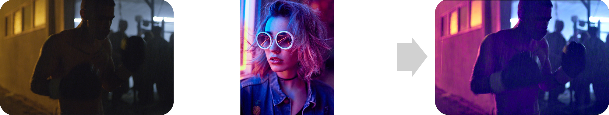

# Video Style Transfer

This repository contains the code for the paper [Photorealistic Style Transfer for Video](https://www.sciencedirect.com/science/article/pii/S0923596521000953).

## Overview

### Data
Image sequences are property of RED cinema, Blackmagic, A24, and Paramount pictures.

### Model

## How to use

### Dependencies

This tutorial depends on Matlab. 

### Run main.m

You will see the results in img/results
